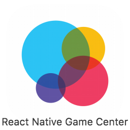
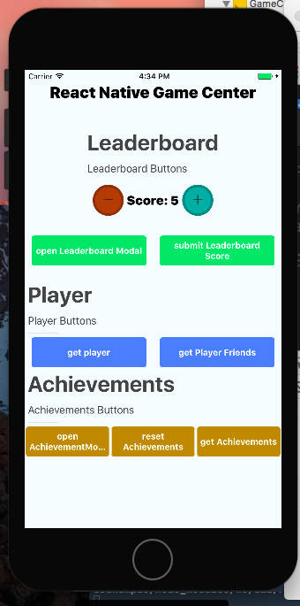
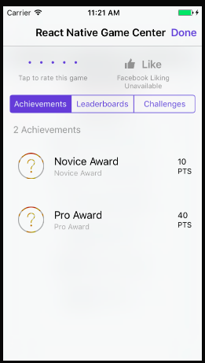
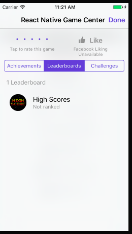
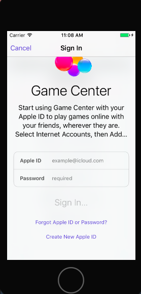
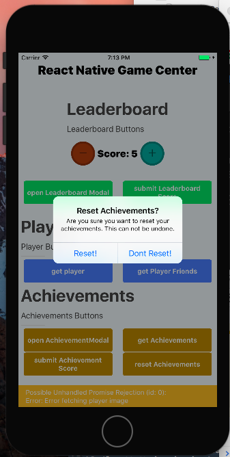

<p align="center"></p><p align="center">Meet react-native-game-center</p><p align="center"><a href="http://standardjs.com/"></a><a href="http://standardjs.com/"></a><a href="https://npmjs.org/package/react-native-game-center"></a><a href="https://npmjs.org/package/react-native-game-center"></a><a href="https://github.com/garrettmac/react-native-game-center/pulls?q=is:pr is:closed"></a><a href="https://github.com/garrettmac/react-native-game-center/issues?q=is:issue is:closed"></a>   <a></a><a></a><a><a></a><a href="https://gitter.im/garrettmac/react-native-game-center?utm_source=badge&utm_medium=badge&utm_campaign=pr-badge&utm_content=badge"></a></p>

# React Native Game Center
hire me!
<p align="center">





</p>

# Contents

- [React Native Game Center](#react-native-game-center)
  * [Contents](#contents)
  * [Getting Started](#getting-started)
  * [Basic Usage](#basic-usage)
  * [Installation](#installation)
  * [Set Up](#set-up)
- [Example](#example)
- [Methods](#methods)
- [Init Method](#init-method)
  * [init()](#init----promise--)
- [Player Methods](#player-methods)
  * [getPlayer()](#getplayer--promise--)
  * [getPlayerImage()](#getplayerimage--promise--)
  * [getPlayerFriends()](#getplayerfriends--promise--)
- [Leaderboard Methods](#leaderboard-methods)
  * [openLeaderboardModal()](#openleaderboardmodal--promise--)
  * [submitLeaderboardScore()](#submitleaderboardscore--promise--)
  * [getLeaderboardPlayers()](#getLeaderboardPlayers--promise--)
  * [getTopLeaderboardPlayers()](#getTopLeaderboardPlayers--promise--)
- [Achievements Methods](#achievements-methods)
  * [openAchievementModal()](#openachievementmodal--promise--)
  * [getAchievements()](#getachievements--promise--)
  * [resetAchievements()](#resetachievements--promise--)
  * [submitAchievementScore()](#submitachievementscore--promise--)

- [TODO](#todo)

# Getting Started

- Install `react-native` first

```bash
npm i react-native -g
react-native init myApp
cd myApp
yarn add react-native-game-center
react-native link
react-native run-ios
```

# Basic Usage

- In your `index.js`, use:
```bash
import RNGameCenter from "react-native-game-center"

RNGameCenter.getPlayer().then(player=>console.log("player: ",player))
```


# Installation

- From project root

```bash
yarn add react-native-game-center
react-native link
react-native run-ios
```
then **Follow setup Instructions**

# Set Up
> See [SETUP.md](SETUP.md)


# Example

or clone the repo and play with the example project

```bash
$ git clone https://github.com/garrettmac/react-native-game-center
$ cd react-native-game-center/GameCenterExample
$ yarn install
$ npm start
```


# Init Method

* [init() <Promise?>](#init----promise--)
    - [Details](#details)
    - [Parameters](#parameters)
    - [Usage](#usage)

## init() <Promise?>

#### Details

Initiates your app with Game Center.
Add this to the top of your app before your `AppRegister`.


**ITUNES CONNECT APP DASHBOARD**
> https://itunesconnect.apple.com/WebObjects/iTunesConnect.woa/ra/ng/app

**Then**
> SELECT APP > Feature > Game Center

#### Parameters

| Name  | Required | Default    | Description |
|--------------|--------------|--------------|--------------|
| leaderboardIdentifier |  Yes | `undefined` | Your apps default leaderboard Identifier. You can can several of these but at least one is required.  |
| achievementIdentifier | No | `undefined` | Your apps default achievement Identifier. Not required. Set this to avoid having to keep passing it in.  |


#### Usage

**Basic**

```jsx
const leaderboardIdentifier="high_scores"

  GameCenter.init({leaderboardIdentifier})
```

**Advanced**

```jsx
const leaderboardIdentifier="high_scores"
const achievementIdentifier="novice_award"


//init app
GameCenter.init({leaderboardIdentifier,achievementIdentifier})
  .then(console.log)
  .catch(console.warn)

```


# Player Methods

[Player Methods](#player-methods)
 * [getPlayer <Promise?>](#getplayer--promise--)
     - [Details](#details-1)
     - [Parameters](#parameters-1)
     - [Basic Usage](#basic-usage-1)
     - [Response](#response)
 * [getPlayerImage <Promise?>](#getplayerimage--promise--)
     - [Details](#details-2)
     - [Parameters](#parameters-2)
     - [Usage](#usage-1)
     - [Success Response](#success-response)
     - [Failed Response](#failed-response)
   + [getPlayerFriends](#getplayerfriends)
     - [Details](#details-3)
     - [Parameters](#parameters-3)
     - [Usage](#usage-2)
     - [Response](#response-1)

## getPlayer <Promise?>

#### Details

Gets logged in user.

#### Parameters

No Parameters

#### Basic Usage

```jsx
  GameCenter.getPlayer().then(player=>{
      console.log("player: ", player);
  })
```

#### Response

```json
{alias: "Garrettmacmac", displayName: "Me", playerID: "G:8135064222"}
```


## getPlayerImage <Promise?>


#### Details

Gets logged player image if available.
Most players don't have one.

#### Parameters

No Parameters

#### Usage

```jsx
  GameCenter.getPlayerImage().then(image=>{
      console.log("image: ", image);
  })
```
####  Success Response

```json
{image: "/path/to/image.png"}
```
####  Failed Response

```json
Error fetching player image
```


### getPlayerFriends

#### Details

Gets a list of players.
Most games don't have this anymore as Apple took away the game center App.
Now you see lots of users connect via Facebook, SMS and by geolocation.

#### Parameters

No Parameters

#### Usage

```jsx
  GameCenter.getPlayerFriends().then(friends=>{
      console.log("friends: ", friends);
  })
```

####  Response
I don't know what this looks like, as I don't have friends 😫 and Apple said they are depreciating support for this is new versions.

**Success**
```json
[...array of friends]
```
or

```json
undefined
```

**Failed**

```json
Error fetching player friends
```


# Leaderboard Methods


- [Leaderboard Methods](#leaderboard-methods)
  * [openLeaderboardModal <Promise?>](#openleaderboardmodal--promise--)
      - [Details](#details-4)
      - [Parameters](#parameters-4)
      - [Usage](#usage-3)
      - [Success Response](#success-response-1)
      - [Failed Response](#failed-response-1)
  * [submitLeaderboardScore <Promise?>](#submitleaderboardscore--promise--)
      - [Details](#details-5)
      - [Parameters](#parameters-5)
      - [Usage](#usage-4)
      - [Response](#response-2)
  * [getLeaderboardPlayers <Promise?>](#getleaderboardplayers--promise--)
      - [Details](#details-6)
      - [Parameters](#parameters-6)
      - [Usage](#usage-5)
      - [Response](#response-3)


## openLeaderboardModal <Promise?>

#### Details

Opens Game Center Modal on Leaderboard Page

#### Parameters

No Parameters

#### Usage

```jsx
  GameCenter.openLeaderboardModal()
  .then(success=>{})//is open
  .catch(error=>{})//could not open

```

#### Success Response

```json
opened leaderboard modal
```
#### Failed Response

```json
opened leaderboard modal
```


## submitLeaderboardScore <Promise?>

#### Details
Submit progress of users leaderboard

#### Parameters

| Name  | Required | Default    | Description |
|--------------|--------------|--------------|--------------|
| score |  Yes | n/a | some number to track for leaderboard    |
| leaderboarIdentifier |  No* (see Response) | `leaderboarIdentifier` set up in Itunes Connect  |


#### Usage


**Basic**

```jsx
let options={score:50};

//reverts to default leaderboarIdentifier set up in init()
GameCenter.submitLeaderboardScore(options)
//now update state
this.setState(options)
```

**Advanced**
```jsx
let options={
  score:50,
  leaderboarIdentifier:"some_other_leaderboard"
};

GameCenter.submitLeaderboardScore(options)
  .then(res=>{
    if(res==="Successfully submitted score")
          this.setState({score:50})
  })
  .catch(console.warn("Users progress is not being tracked due to error."))

```


#### Response

**Success**

```json
"Successfully submitted score"
```


**Failed**

```json
"Error submitting score."
```

## getLeaderboardPlayers <Promise?>

#### Details
Get information about certain player ids on the leaderboard

#### Parameters

| Name  | Required | Default    | Description |
|--------------|--------------|--------------|--------------|
| playerIds[] |  Yes | n/a | An array of player ids to recieve data for |
| leaderboardIdentifier |  No if set in init | Set in init |`leaderboardIdentifier` set up in Itunes Connect  |


#### Usage


**Basic**
```jsx
let options={
  playerIds: ["player_1","player_2"], //Please note that this is the player id as set by apple and not the user name
  leaderboarIdentifier:"some_other_leaderboard" //Optional
};

GameCenter.getLeaderboardPlayers(options)
  .then(res=>{
    this.setState({players:res})
  })
  .catch(console.warn("Leaderboard fetch failed"))

```


#### Response

**Success**

```json
[
  {
    "rank":"rank of player on global leaderboard",
    "value":"score of the player on the leaderboard",
    "displayName":"display name of the player",
    "alias":"alias of the player",
    "playerID":"id of the player"
  }
]
```


**Failed**

```json
"Error getting leaderboard players."
```


## getTopLeaderboardPlayers <Promise?>

#### Details
Get information about top players on the leaderboard

#### Parameters

| Name  | Required | Default    | Description |
|--------------|--------------|--------------|--------------|
| count |  Yes | n/a | Anmount of top players to fetch |
| leaderboardIdentifier |  No if set in init | Set in init |`leaderboardIdentifier` set up in Itunes Connect  |


#### Usage


**Basic**
```jsx
let options={
  count:4,
  leaderboarIdentifier:"some_other_leaderboard" //Optional
};

GameCenter.getLeaderboardPlayers(options)
  .then(res=>{
    this.setState({topPlayers:res})
  })
  .catch(console.warn("Leaderboard fetch failed"))

```


#### Response

**Success**

```json
[
  {
    "rank":"rank of player on global leaderboard",
    "value":"score of the player on the leaderboard",
    "displayName":"display name of the player",
    "alias":"alias of the player",
    "playerID":"id of the player"
  }
]
```


**Failed**

```json
"Error getting top leaderboard players."
```


# Achievements Methods

- [Achievements Methods](#achievements-methods)
  * [openAchievementModal <Promise?>](#openachievementmodal--promise--)
      - [Details](#details-6)
      - [Parameters](#parameters-6)
      - [Usage](#usage-5)
      - [Response](#response-3)
  * [getAchievements <Promise?>](#getachievements--promise--)
      - [Details](#details-7)
      - [Parameters](#parameters-7)
      - [Usage](#usage-6)
      - [Response](#response-4)
  * [resetAchievements <Promise?>](#resetachievements--promise--)
      - [Details](#details-8)
      - [Parameters](#parameters-8)
      - [Usage](#usage-7)
      - [Response](#response-5)
  * [submitAchievementScore <Promise?>](#submitachievementscore--promise--)
      - [Details](#details-9)
      - [Parameters](#parameters-9)
      - [Usage](#usage-8)
      - [Response](#response-6)

## openAchievementModal <Promise?>

#### Details

Opens Game Center Modal on Leaderboard Page

#### Parameters

No Parameters

#### Usage

```jsx
  GameCenter.openAchievementModal()
  .then(success=>{})//is open
  .catch(error=>{})//could not open

```

#### Response

**Success**

```json
opened achievement modal
```

**Failed**

```json
opened achievement modal
```


## getAchievements <Promise?>

#### Details

Gets players achievements if completed more than 0%.
You must declare `submitAchievementScore` at least once before calling this.

#### Parameters

No Parameters

#### Usage

```jsx
  GameCenter.getAchievements()
  .then(achievements=>{
    console.log(achievements)
    })
  .catch(error=>{})//failed

```

#### Response

```json
[{"showsCompletionBanner":false,"lastReportedDate":1506301241432,"completed":true,"percentComplete":100,"identifier":"novice_award"},{"showsCompletionBanner":false,"lastReportedDate":1506301211362,"completed":false,"percentComplete":5,"identifier":"pro_award"}]
```

or

```json
[]
```


## resetAchievements <Promise?>

> []

#### Details

Resets the players achievements.

#### Parameters


| Name  | Required | Default    | Description |
|--------------|--------------|--------------|--------------|
| hideAlert |  No | `{hideAlert:false}` | Hide reset confirmation prompt   |


#### Usage

**Basic**

```jsx
  //Triggers confirmation prompt
  GameCenter.resetAchievements()

  // hides confirmation prompt
  GameCenter.resetAchievements({hideAlert:true})
```
**Advanced**
```jsx
  GameCenter.resetAchievements(res=>{
    if(res.resetAchievements){
      do something if user reset achievements
    }
  })
  .catch(alert("Could not reset achievements at this time. Try again later."))
```

#### Response

If you pass in `{hideAlert:true}` into `GameCenter.resetAchievements()` Method **OR** the you don't pass in the `hideAlert` parameter and player presses "Reset"

```json
{"resetAchievements":true,"message":"User achievements reset"}
```

If you don't pass in the `hideAlert` parameter and player presses "No!"

```json
{"resetAchievements":false,"message":"User achievements not reset"}
```


## submitAchievementScore <Promise?>


#### Details
Submit progress of users achievements

#### Parameters

| Name  | Required | Default    | Description |
|--------------|--------------|--------------|--------------|
| percentComplete |  Yes | n/a | number, float, or string of the percent achievement is complete. **Range 1-100**    |
| achievementIdentifier |  No* (see Response) | `achievementIdentifier` set up in Itunes Connect  |
| hideCompletionBanner |  No | `false` | Hides Game center banner when complete   |


#### Usage


```jsx
let options={
            percentComplete:50,
            achievementIdentifier:"novice_award"
          };

GameCenter.submitAchievementScore(options).then(res=>{
  if(res){
//success
  }
})
.catch(alert("Could not update your achievements at this time. Try again later."))
```


#### Response

**Success**

```json
[null]
```

Not required if `achievementIdentifier` set as default in `init()`. `achievementIdentifier` always reverts to default unless defended. However, will reject promise if not passed in `init()` or `submitAchievementScore()` function

**Failed**

```json
No Game Center `achievementIdentifier` passed and no default set
```


# TODO


ADD METHODS

[ ] getLeaderboardPlayers()
[ ] invite()
[ ] challengeComposer()
[ ] findScoresOfFriendsToChallenge()
