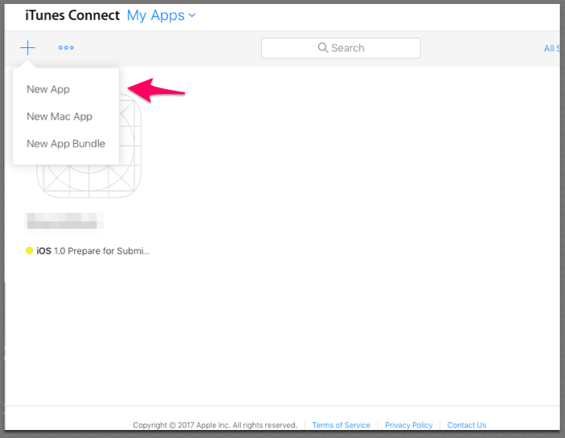
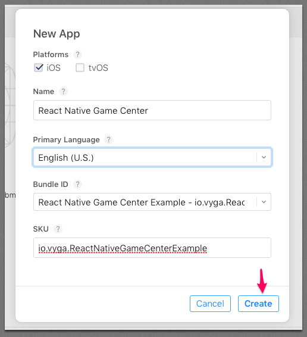
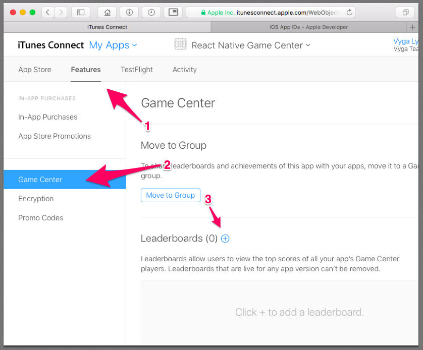
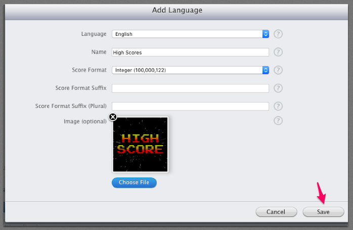
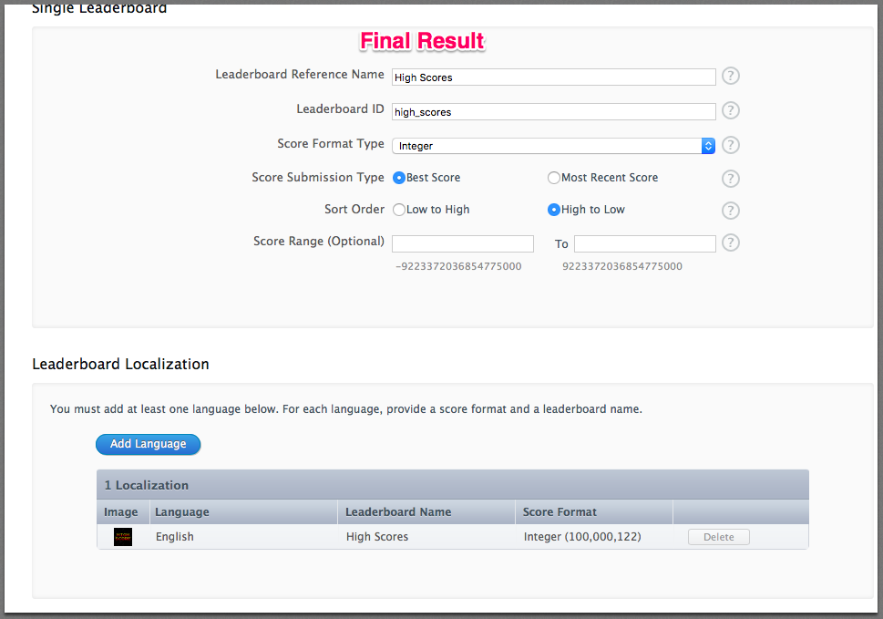
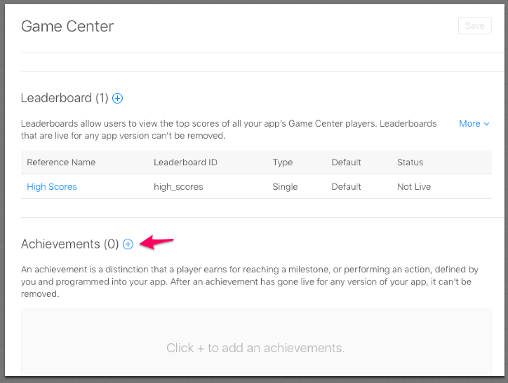
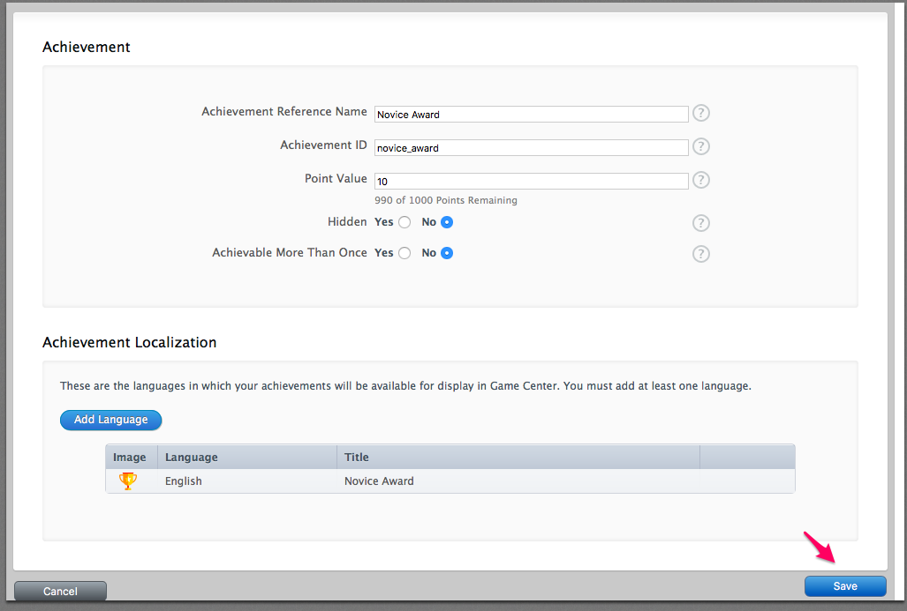
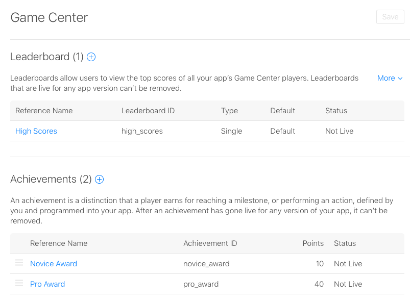
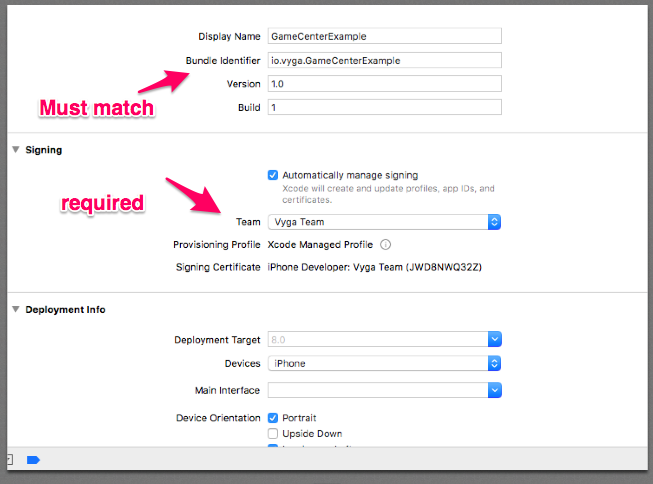
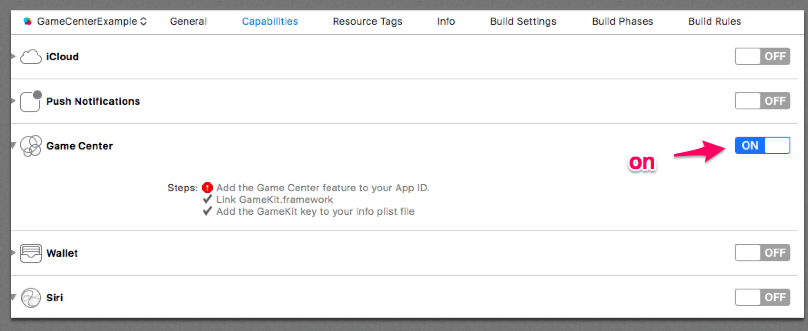

# Setup

First create an app id for your app
https://developer.apple.com/account/ios/identifier/bundle

https://itunesconnect.apple.com/WebObjects/iTunesConnect.woa/ra/ng/app
New App

### Create New Leaderboard

### Create New Achievements

### In Xcode

